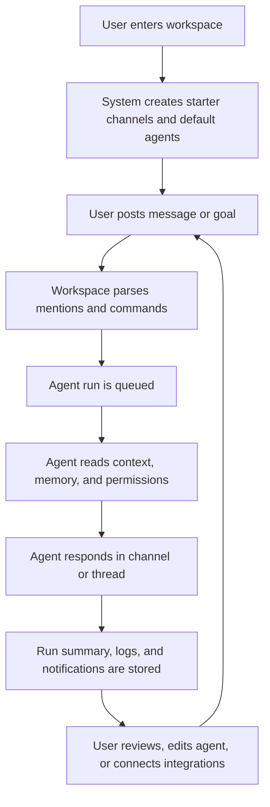

## 1. Product Overview
askai.gg is a collaborative AI workspace where humans and autonomous agents work together in channels, threads, and shared workflows.
- It helps teams create, monitor, and direct AI agents that can chat, run jobs, use tools, and visibly collaborate inside a persistent workspace.
- The MVP targets founders, operators, product teams, and technical teams who want Nebula-like coordination without losing transparency or control.

## 2. Core Features

### 2.1 User Roles
| Role | Registration Method | Core Permissions |
|------|---------------------|------------------|
| Owner | Email or OAuth invite | Manage billing, workspace settings, integrations, members, and all agents |
| Member | Email or OAuth invite | Participate in chat, create tasks, create agents if allowed, view logs and runs |
| Agent | System-created identity | Read assigned channels, respond to mentions, execute approved tools, post updates |

### 2.2 Feature Module
1. **Workspace Home**: onboarding, activity summary, quick agent prompt, recent threads, usage snapshot
2. **Channel Workspace**: channel list, threaded chat, mentions, attachments, agent status, typing/activity indicators
3. **Agent Directory**: browse agents, filter by status or toolset, create new agent from natural language, launch templates
4. **Agent Detail**: profile, goals, permissions, tools, schedule, run history, logs, memory summary
5. **Integrations Hub**: list connected services, pending connections, scope approval model, per-agent permission mapping
6. **Notifications & Inbox**: mentions, failed runs, approvals, agent escalations, integration prompts
7. **Admin & Team Settings**: workspace metadata, invites, role assignment, security controls, environment setup

### 2.3 Page Details
| Page Name | Module Name | Feature description |
|-----------|-------------|---------------------|
| Workspace Home | Hero composer | Natural-language input to describe a goal and generate a starter team of agents |
| Workspace Home | Threads feed | Shows recent multi-agent discussions, status badges, unread counts, and ownership |
| Channel Workspace | Channel sidebar | Lists default channels such as `#general`, `#research`, `#ops`, plus custom channels |
| Channel Workspace | Shared chat timeline | Supports human and agent messages, markdown, files, inline task cards, and action receipts |
| Channel Workspace | Mention parsing | Detects `@agent` mentions, triggers an agent run, and displays activity states in real time |
| Channel Workspace | Thread panel | Expands conversations into focused threads with participant chips and run context |
| Agent Directory | Agent gallery | Displays starter agents, custom agents, tool badges, model tags, and current state |
| Agent Directory | Create agent flow | Converts a natural language prompt into a draft agent spec with editable name, role, goals, and schedule |
| Agent Detail | Info tab | Shows role, description, goals, visibility, model, and execution mode |
| Agent Detail | Tools tab | Displays approved tools, integration scopes, and sandbox permissions |
| Agent Detail | Triggers tab | Configures mentions, cron schedules, and future workflow events |
| Agent Detail | Prompt tab | Edits system prompt, guardrails, memory policy, and escalation rules |
| Integrations Hub | Provider cards | Lists Gmail, GitHub, Slack, Notion, Linear, Google Drive, and future connectors |
| Integrations Hub | Scope approval | Shows which scopes a user approves globally and which an agent may use |
| Notifications & Inbox | Activity inbox | Aggregates mentions, failures, approvals, summaries, and scheduled run completions |
| Admin & Team Settings | Members | Invites humans, assigns roles, and clearly distinguishes agents from people |
| Admin & Team Settings | Security | Manages API keys, audit policies, sandbox defaults, and rate limit settings |

## 3. Core Process
The primary MVP flow starts when a user joins a workspace, lands on the home view, and describes a goal such as building a research team or creating a daily digest agent. The system seeds default channels and starter agents, then lets the user chat in shared channels or direct-message individual agents.

When a message contains an `@agent` mention, the mentioned agent receives the relevant channel context, posts a visible activity update, and returns a response inside the workspace. Users can open the agent directory, create or edit agents from natural language, enable or restrict tools, and view recent run logs.

Admins can invite teammates, connect integrations, and define which agents are allowed to act on external systems. Background jobs power scheduled runs so agents can operate continuously, while a transparent log and inbox keep humans informed and able to intervene.

## 4. User Interface Design
### 4.1 Design Style
- Primary colors: deep midnight navy, electric cobalt, neon magenta accents, soft cyan status tones
- Button style: rounded-2xl controls with soft inner glow, subtle glass borders, and strong hover contrast
- Fonts and sizes: expressive display serif for key headings paired with a clean grotesk for body copy and UI labels
- Layout style: desktop-first collaborative workspace with a persistent left rail, center conversation canvas, and contextual right panel
- Icon style suggestions: crisp outline icons with luminous status dots, agent initials, and orbital brand motifs
- Motion: staged reveals, subtle terminal-like activity pulses, sliding drawers, and message appearance transitions

### 4.2 Page Design Overview
| Page Name | Module Name | UI Elements |
|-----------|-------------|-------------|
| Workspace Home | Hero composer | Large prompt field, glowing shell, example prompts, animated team preview |
| Workspace Home | Threads feed | Dense cards with unread badges, participant chips, timestamps, and hover lift |
| Channel Workspace | Chat timeline | Alternating human and agent rows, markdown renderer, run progress indicators, thread handles |
| Channel Workspace | Sidebar | High-contrast channel pills, workspace members, active agents, online dots, notification counters |
| Agent Directory | Agent list | Search, segmented filters, template cards, availability states, tool labels |
| Agent Detail | Tabbed panel | Large avatar tile, model selector, settings cards, status strip, editable metadata |
| Integrations Hub | Provider cards | Provider logos, connected state, scope chips, per-agent approval rows |
| Notifications & Inbox | Feed | Compact event list, severity tags, quick actions, escalation banners |

### 4.3 Responsiveness
- Desktop-first layout with a three-panel experience on large screens
- Tablet adapts to a two-panel layout with slide-over thread and agent detail drawers
- Mobile uses bottom navigation, full-screen channel views, and compact message cards inspired by the provided Nebula references
- Touch targets stay large, composer stays pinned, and dense activity is summarized into cards rather than full tables

### 4.4 3D Scene Guidance
- Not required for the MVP
