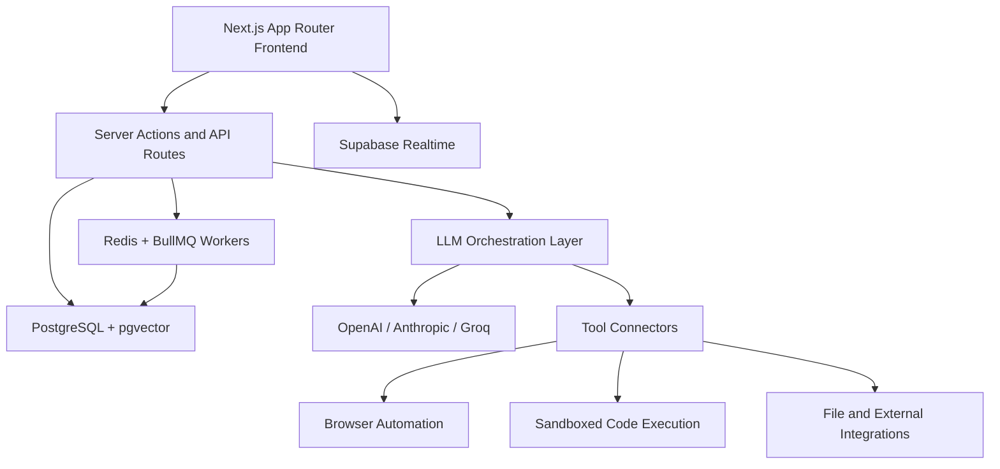
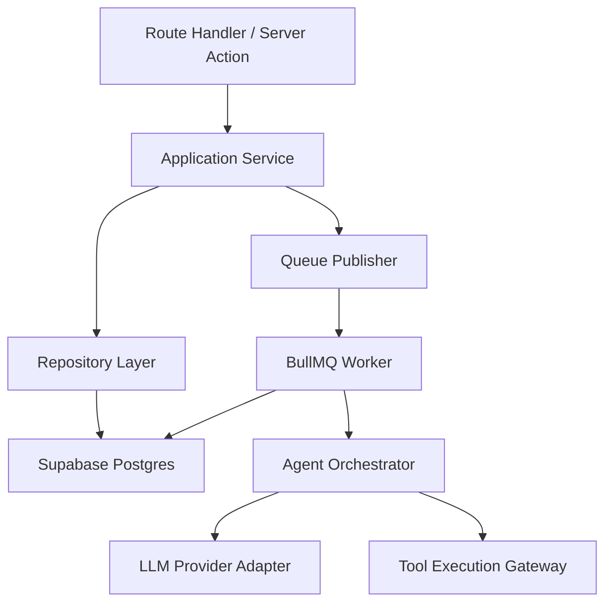
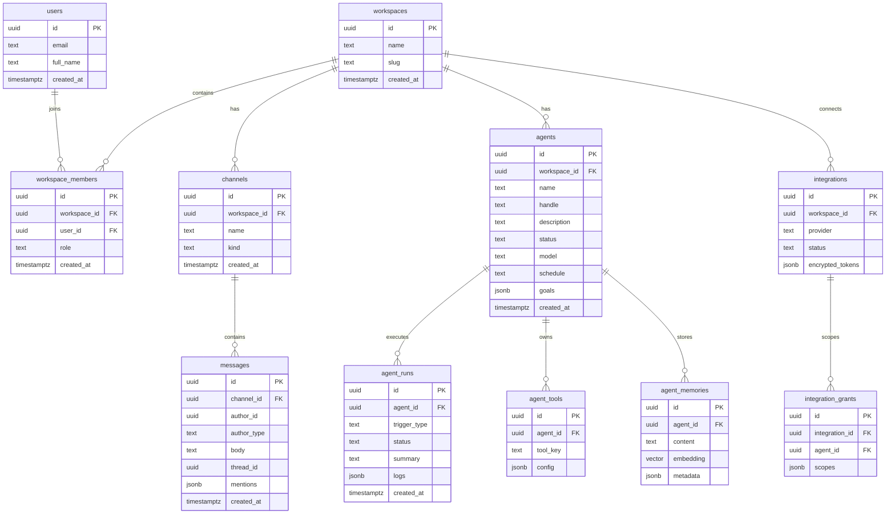

## 1. Architecture Design


## 2. Technology Description
- Frontend: Next.js 15 + React 19 + TypeScript + Tailwind CSS 4
- Initialization Tool: `create-next-app`
- Backend: Next.js Route Handlers and Server Actions for MVP
- Database: Supabase Postgres with `pgvector`
- Auth: Supabase Auth with email magic link plus Google and GitHub OAuth
- Realtime: Supabase Realtime for channel messages, agent state, and notifications
- Queue and background jobs: Redis + BullMQ for mention-triggered and scheduled agent runs
- AI orchestration: LangGraph with provider adapters for OpenAI, Anthropic, and Groq
- Validation: Zod for shared API contracts
- State and data fetching: TanStack Query plus lightweight client state via Zustand where useful
- Charts and logs: Recharts for simple analytics cards in later phases

## 3. Route Definitions
| Route | Purpose |
|-------|---------|
| `/` | Workspace home with onboarding, quick-start goal input, and recent threads |
| `/channels/[channelId]` | Shared channel workspace with timeline, members, and thread activity |
| `/agents` | Agent directory, templates, search, and creation flow |
| `/agents/[agentId]` | Agent profile, tools, triggers, prompt, logs, and status |
| `/integrations` | Provider management and permission mapping |
| `/inbox` | Notifications, escalations, and failures |
| `/settings` | Workspace settings, membership, roles, and security controls |
| `/auth/callback` | OAuth and magic link completion |

## 4. API Definitions
### TypeScript Types
```ts
export type Role = "owner" | "member" | "agent";

export type Workspace = {
  id: string;
  name: string;
  slug: string;
  createdAt: string;
};

export type Channel = {
  id: string;
  workspaceId: string;
  name: string;
  kind: "public" | "private" | "dm";
};

export type Agent = {
  id: string;
  workspaceId: string;
  name: string;
  handle: string;
  description: string;
  goals: string[];
  status: "online" | "idle" | "running" | "paused";
  model: string;
  tools: string[];
  schedule: string | null;
};

export type Message = {
  id: string;
  channelId: string;
  authorType: "human" | "agent" | "system";
  authorId: string;
  body: string;
  mentions: string[];
  threadId: string | null;
  createdAt: string;
};

export type AgentRun = {
  id: string;
  agentId: string;
  triggerType: "mention" | "schedule" | "manual" | "workflow";
  status: "queued" | "running" | "succeeded" | "failed";
  summary: string | null;
  createdAt: string;
};
```

### Route Handlers
| Method | Endpoint | Purpose |
|--------|----------|---------|
| `GET` | `/api/bootstrap` | Returns seeded workspace, channels, agents, home feed, and current user |
| `GET` | `/api/channels/:id` | Returns channel details, members, message timeline, and threads |
| `POST` | `/api/messages` | Creates a message, extracts mentions, and queues any agent runs |
| `POST` | `/api/agents/generate` | Converts natural language into a draft agent configuration |
| `POST` | `/api/agents` | Creates a new agent from the generated or edited draft |
| `PATCH` | `/api/agents/:id` | Updates profile, tools, permissions, or schedule |
| `GET` | `/api/agents/:id/runs` | Returns recent agent runs and logs |
| `GET` | `/api/integrations` | Lists provider connection status and approved scopes |
| `POST` | `/api/integrations/:provider/connect` | Starts OAuth connection flow |
| `POST` | `/api/runs/:id/retry` | Retries a failed agent run |

### Example Request and Response
```ts
// POST /api/agents/generate
type GenerateAgentRequest = {
  prompt: string;
  workspaceId: string;
};

type GenerateAgentResponse = {
  draft: {
    name: string;
    handle: string;
    description: string;
    goals: string[];
    tools: string[];
    schedule: string | null;
    visibility: "workspace" | "private";
  };
};
```

## 5. Server Architecture Diagram


## 6. Data Model
### 6.1 Data Model Definition


### 6.2 Data Definition Language
```sql
create extension if not exists vector;

create table workspaces (
  id uuid primary key default gen_random_uuid(),
  name text not null,
  slug text not null unique,
  created_at timestamptz not null default now()
);

create table users (
  id uuid primary key default gen_random_uuid(),
  email text not null unique,
  full_name text,
  created_at timestamptz not null default now()
);

create table workspace_members (
  id uuid primary key default gen_random_uuid(),
  workspace_id uuid not null references workspaces(id) on delete cascade,
  user_id uuid not null references users(id) on delete cascade,
  role text not null check (role in ('owner', 'member', 'agent')),
  created_at timestamptz not null default now(),
  unique (workspace_id, user_id)
);

create table channels (
  id uuid primary key default gen_random_uuid(),
  workspace_id uuid not null references workspaces(id) on delete cascade,
  name text not null,
  kind text not null check (kind in ('public', 'private', 'dm')),
  created_at timestamptz not null default now()
);

create table agents (
  id uuid primary key default gen_random_uuid(),
  workspace_id uuid not null references workspaces(id) on delete cascade,
  name text not null,
  handle text not null,
  description text not null,
  status text not null default 'online',
  model text not null default 'gpt-4.1-mini',
  schedule text,
  goals jsonb not null default '[]'::jsonb,
  created_at timestamptz not null default now(),
  unique (workspace_id, handle)
);

create table messages (
  id uuid primary key default gen_random_uuid(),
  channel_id uuid not null references channels(id) on delete cascade,
  author_id uuid not null,
  author_type text not null check (author_type in ('human', 'agent', 'system')),
  body text not null,
  thread_id uuid,
  mentions jsonb not null default '[]'::jsonb,
  created_at timestamptz not null default now()
);

create table agent_runs (
  id uuid primary key default gen_random_uuid(),
  agent_id uuid not null references agents(id) on delete cascade,
  trigger_type text not null check (trigger_type in ('mention', 'schedule', 'manual', 'workflow')),
  status text not null check (status in ('queued', 'running', 'succeeded', 'failed')),
  summary text,
  logs jsonb not null default '[]'::jsonb,
  created_at timestamptz not null default now()
);

create table agent_tools (
  id uuid primary key default gen_random_uuid(),
  agent_id uuid not null references agents(id) on delete cascade,
  tool_key text not null,
  config jsonb not null default '{}'::jsonb
);

create table agent_memories (
  id uuid primary key default gen_random_uuid(),
  agent_id uuid not null references agents(id) on delete cascade,
  content text not null,
  embedding vector(1536),
  metadata jsonb not null default '{}'::jsonb
);

create table integrations (
  id uuid primary key default gen_random_uuid(),
  workspace_id uuid not null references workspaces(id) on delete cascade,
  provider text not null,
  status text not null default 'disconnected',
  encrypted_tokens jsonb not null default '{}'::jsonb,
  unique (workspace_id, provider)
);

create table integration_grants (
  id uuid primary key default gen_random_uuid(),
  integration_id uuid not null references integrations(id) on delete cascade,
  agent_id uuid not null references agents(id) on delete cascade,
  scopes jsonb not null default '[]'::jsonb,
  unique (integration_id, agent_id)
);

create index idx_channels_workspace_id on channels(workspace_id);
create index idx_agents_workspace_id on agents(workspace_id);
create index idx_messages_channel_id on messages(channel_id, created_at desc);
create index idx_agent_runs_agent_id on agent_runs(agent_id, created_at desc);
create index idx_agent_memories_embedding on agent_memories using ivfflat (embedding vector_cosine_ops);
```
